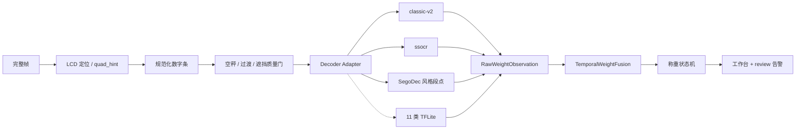

# LCD OCR 开源方案评估与双视频升级实施方案

## 1. 文档目的

本文定义 MouseVision LCD 识别下一阶段的升级路线：引入成熟开源七段码方案作为可插拔解码后端，并以两段真实视频共同验收，解决当前“修好 0001、却破坏 RefVideo”的单视频过拟合问题。

本方案不改变已经确认的职责边界：

- `lcd-ocr` 保持无状态，只负责单帧定位、规范化和数字读取；
- `mousevision` 负责跨帧融合、称重状态机、鼠检测和 `needs_review`；
- 最终体重不允许由 RapidOCR 文本直接决定；
- 工作台与 CLI 必须调用同一套 `HttpOcrReader → TemporalWeightFusion` 主链路。

## 2. 已验证的问题

### 2.1 两套视频表现不一致

| 数据集 | 正确基线 | 当前 HTTP OCR 表现 |
|---|---|---|
| `tmp_ocr_acceptance/0001/source.mp4` | 9 次，约 21–24g | 9 次、`needs_review=0` |
| `RefVideo/9494224d488d6e735c0f108cc5562a2d.mp4` | 8 次 | 工作台仅保存 6 次，且出现 `11.11`、`11.76` 等错误 |

RefVideo 的 TemplateReader 基线约为：

```text
16.15 / 17.22 / 17.57 / 15.10 / 15.64 / 17.55 / 17.77 / 16.87
```

工作台截图和服务器 `record.json` 已证实：

- LCD 为 `0.00` 或过渡值时，七段码路径可能高置信输出 `11.11`；
- LCD 为 `17.72` 时可能输出 `11.76`；
- 错误值已经写入后端记录，并非单纯前端显示错误；
- 工作台确实使用新 `http_ocr`，不存在误走旧 TemplateReader 的问题。

### 2.2 根因

1. 当前 `w/h < 0.32 → 1` 是无条件规则。它修复了 blooming 后的 `21.60 → 22.58`，也会把另一种拍摄条件下的窄 `7` 判成 `1`。
2. 投影分槽在空秤、反光和数字过渡时可能把残留亮线切成四个窄槽，组成高置信 `1111`。
3. 错误非零值过早触发 `ENTER`，随后 `reenter_cooldown` 又可能屏蔽真正的下一次称重，导致 session 数量减少。
4. 现有 RefVideo 自动化测试默认使用 TemplateReader，没有覆盖工作台实际使用的 HTTP OCR 路径。
5. `MouseRegistry` 未向工作台卡片透传 `needs_review/review_reason`，待复核结果仍以普通绿色卡片显示。

结论：当前问题以七段码解码和状态门禁为主，工作台另有告警展示缺口。不能继续只调一个宽高比阈值。

## 3. 开源候选评估

### 3.1 `auerswal/ssocr`

- 项目：<https://github.com/auerswal/ssocr>
- 类型：C 实现的经典七段码 OCR；GPL-3.0-or-later；
- 能力：裁剪、阈值、数字数量、`1` 的宽度比例、形态学处理、调试输出；
- 优点：成熟、无模型、速度快、内存低；
- 风险：仍依赖干净数字条和参数标定；若复制或修改源码并分发，需要评估 GPL 合规。

定位：**第一优先级 A/B 候选**。初期作为独立可执行程序或隔离适配器调用，不直接复制源码进入主仓库。

### 3.2 `SegoDec`

- 项目：<https://github.com/scottmudge/SegoDec>
- 类型：OpenCV 固定字符位置 + 七段测试点 + fuzzy 解码；
- 优点：适合固定秤、固定相机；段位证据比单一字符宽高比可靠；
- 风险：需要为当前 LCD 标定字符起点、宽高、间距和段测试窗口；引入前需确认仓库许可证。

定位：**第一优先级 A/B 候选**。重点借鉴“固定段测试点 + fuzzy 距离”，而不是照搬全部图像定位代码。

### 3.3 七段码 TFLite

- 项目：<https://github.com/renjithsasidharan/seven-segment-ocr>
- 类型：七段显示 Keras OCR / float16 TFLite，含训练数据和训练流程；
- 优点：可处理 blooming、轻微断段和曝光差异；本机 CPU 即可运行，也可转换 ONNX/OpenVINO；
- 风险：开源预训练数据与本项目蓝色 LCD、手机压缩和反光条件不同，必须用本项目样本复测或微调。

定位：**阶段 C 起点**，不直接把开源权重视为生产模型。

### 3.4 完整仪表识别参考架构

- 项目：<https://github.com/jomjol/AI-on-the-edge-device>
- 能力：画面对齐、固定数字 ROI、TFLite 单数字分类、历史值检查、跳变过滤、REST 接口；
- 价值：其“对齐 → 每位 ROI → 小模型 → 后处理”的整体结构与 MouseVision 高度一致；
- 限制：目标主要是水、电、气表，不保证预训练模型适配本项目七段 LCD。

定位：**参考架构与训练/部署工具链**，不整套替换现有 mousevision。

### 3.5 不作为最终值来源的方案

RapidOCR、PaddleOCR、EasyOCR 等通用 OCR 可以继续用于：

- LCD 区域实验性定位；
- 离线审计文本；
- 标注筛选和困难帧发现。

它们不负责最终体重，因为七段显示、反光、倒读和过渡帧不是自然文字识别的优势场景。

## 4. 推荐目标架构



### 4.1 Decoder Adapter

统一接口：

```python
class DigitDecoder(Protocol):
    name: str

    def read(self, normalized_strip: np.ndarray) -> DecoderResult:
        ...
```

统一输出：

```python
@dataclass
class DecoderResult:
    digits: list[str]              # 固定四槽，blank | 0..9 | invalid
    digit_confidences: list[float]
    weight: float | None
    status: str                    # readable | zero_display | transition | unreadable
    quality: float
    evidence: dict                 # 段位、宽高、top_bar、阈值等调试证据
```

环境变量或 profile 选择后端：

```text
LCD_OCR_DECODER=classic_v2 | ssocr | segodec | tflite
```

生产主路径每帧只运行一个已验收后端。多后端并行仅用于离线比较和抽样审计，避免重复耗时。

### 4.2 `1/7` 判断原则

禁止继续使用“宽度小于某阈值就无条件判 `1`”。至少同时考虑：

- 顶部横段的跨度、连续性和亮度；
- 右上、右下竖段是否完整；
- 字符宽高比；
- 横段是否与右侧竖段连通；
- 多帧中同一槽位的段位稳定性。

宽高比只能作为证据之一。顶部横段明确存在时，即使字符较窄也应优先考虑 `7`。

### 4.3 空秤与过渡门禁

空秤判断必须发生在四位体重组合之前，不能依靠 `compose_weight()` 猜测：

1. 在完整数字条上检测真实 `0.00`、全 blank、低前景占比和段位闪烁；
2. 槽位数量、字符中心和小数点布局不合理时返回 `transition/unreadable`；
3. `1111` 不可硬编码为非法，因为 11.11g 在业务上可能真实存在；应依据原始段位和几何证据拒绝“伪 1”；
4. `transition/unreadable` 不得触发 `ENTER`；
5. `mouse_present` 只能辅助裁决，不能把视觉上不可靠的数字升级为有效体重。

## 5. 实施阶段

### 阶段 0：补齐真实门禁

新增两套版本化数据：

```text
tests/fixtures/lcd_ocr/0001/
tests/fixtures/lcd_ocr/refvideo/
```

RefVideo 至少保存：

- 8 个稳定平台关键帧；
- `0.00` 空秤帧；
- 鼠悬空/刚放下/刚取走的过渡帧；
- `17.22 / 17.57 / 17.55 / 17.77` 等含 `7` 帧；
- 当前误读为 `11.11 / 11.76` 的困难帧及其规范化槽位。

新增 HTTP OCR 端到端门禁。现有 TemplateReader RefVideo 测试继续保留，但不得再代表工作台主路径验收。

### 阶段 1：开源后端离线 A/B

实现：

```text
services/lcd_ocr/decoders/base.py
services/lcd_ocr/decoders/classic_v2.py
services/lcd_ocr/decoders/ssocr_adapter.py
services/lcd_ocr/decoders/segodec_adapter.py
tools/compare_lcd_decoders.py
```

比较工具对同一规范化数字条输出：

- 每槽字符和置信度；
- 最终值；
- status；
- 单帧耗时；
- 段位调试图；
- 与真值的差异。

先离线选择最稳定后端，不立即切生产。

### 阶段 2：经典方案生产化

若 `ssocr` 或 SegoDec 风格解码能同时通过两套视频：

1. 固定秤型 profile；
2. 设为 OCR 服务唯一生产 decoder；
3. 保留旧 classic 作为离线对照；
4. 重建镜像并重跑工作台；
5. 保存完整 run 证据，不以终端临时输出代替记录。

### 阶段 3：11 类轻量模型

仅当经典方案仍无法处理反光、断段和压缩时启动：

- 类别：`blank + 0..9`；
- 输入：单槽灰度图或二值图；
- 首版优先使用小型 CNN，导出 TFLite 或 ONNX；
- 数据按视频划分训练/验证，禁止相邻帧跨集合；
- 训练时增强曝光、blooming、运动模糊、JPEG、局部遮挡和轻微透视；
- 模型只识别单槽，不负责 session 状态。

## 6. 工作台配套修复

### 6.1 告警透传

`MouseRegistry._mice_in_dir()` 和 `/api/mice` 必须返回：

```json
{
  "needs_review": true,
  "review_reason": "cluster_conflict:..."
}
```

前端规则：

- `needs_review=true` 使用橙色/红色卡片；
- 文案显示“待复核”，不能只显示普通“评分”；
- 批次头部显示 `clean / needs_review / total`；
- 报表默认不得把待复核值纳入正式统计。

### 6.2 照片一致性

照片选择除鼠检测外，还需要：

- 候选帧位于最终平台窗口；
- 候选帧的原始 OCR 观察与最终平台值一致；
- 鼠框与秤盘区域存在合理重叠，而不是只检测到秤盘上方的黑色目标；
- LCD 为 `0.00`、过渡或不可读时禁止作为正常称重照片。

## 7. 验收门槛

### 7.1 单帧

| 指标 | 门槛 |
|---|---:|
| 0001 稳定关键帧 | 全部通过 |
| RefVideo 稳定关键帧 | 全部通过 |
| 空秤/过渡帧误报非零体重 | 0 |
| `1/7` 专项样本 | 100% |
| 单帧 `locate+normalize+decode` CPU p95 | ≤ 25ms |

### 7.2 端到端

| 视频 | session | 目标值 | review |
|---|---:|---|---:|
| 0001 `source.mp4` | 9 | `22.75 / 21.60 / 23.49 / 23.81 / 22.10 / 24.18 / 22.71±0.08 / 23.44 / 22.80` | 0 |
| RefVideo | 8 | `16.15 / 17.22 / 17.57 / 15.10 / 15.64 / 17.55 / 17.77 / 16.87`，允许 ±0.10g | 0 |

同时要求：

- CLI 与工作台对同一视频输出完全一致；
- 不允许出现额外 session、合并 session 或漏检；
- 所有卡片照片的 LCD 显示与记录值一致；
- `needs_review` 必须在 CLI、API、工作台和报告中一致可见。

## 8. 回退与发布

发布采用显式 decoder 开关：

```text
LCD_OCR_DECODER=classic_v2
```

若新后端未通过双视频门禁：

- 不部署到工作台主路径；
- 保持当前稳定镜像；
- A/B 结果与困难帧进入训练数据；
- 禁止通过放宽时序或生理范围阈值掩盖单帧错误。

镜像发布前记录：Git commit、镜像 ID、profile 名、decoder 名和双视频验收报告。远程回放结果必须保存在挂载的数据目录，确保可追溯。

## 9. 推荐结论

实施顺序建议为：

```text
补 RefVideo HTTP 门禁
→ 接入 ssocr 与 SegoDec 离线 A/B
→ 选一个经典后端生产化
→ 两套视频仍失败时训练 11 类 TFLite
→ 工作台补 review 与照片一致性
→ 双视频验收后发布
```

最有希望的短期方案是：继续使用现有定位与时序框架，用 `ssocr` 或 SegoDec 风格的段测试点替换当前依赖单一宽高阈值的解码规则。这样改动范围小、CPU 足够，也能避免为了修一段视频不断覆盖另一段视频的参数。

## 10. 实现落地点（仓库内）

已落地骨架（默认生产 decoder=`classic_v2`，可用 `LCD_OCR_DECODER` 切换）：

| 路径 | 作用 |
|---|---|
| `services/lcd_ocr/decoders/` | `classic_v2` / `segodec` / `ssocr` 适配器 |
| `services/lcd_ocr/quality.py` | 空秤 / 过渡质量门 |
| `services/lcd_ocr/accept_refvideo.py` | RefVideo **严格**单帧门禁 |
| `tools/compare_lcd_decoders.py` | 离线 A/B |
| `tools/accept_dual_videos.py` | 双视频 HTTP e2e（`weight_reader=http_ocr` 字符串配置） |

门禁要点：

- 单帧 0001 / RefVideo **不能**单独作为发布依据；
- 发布前必须本地跑通 `tools/accept_dual_videos.py`：**0001 9/9 review=0** 且 **RefVideo 8/8 review=0**；
- `quad_hint`：客户端周期性强制重定位；服务端 hint 与 HSV 偏差过大时采用 HSV；
- `_vote_variants`：raw/CLAHE 冲突时不逐槽拼接，优先完整动物体重读数；
- HTTP ENTER 要求 `mouse_present=True`；不设动物最低体重阈值。低体重读数必须交由画面质量、鼠检测、时序冲突和 `needs_review` 判定，不得按体重区间静默过滤。
