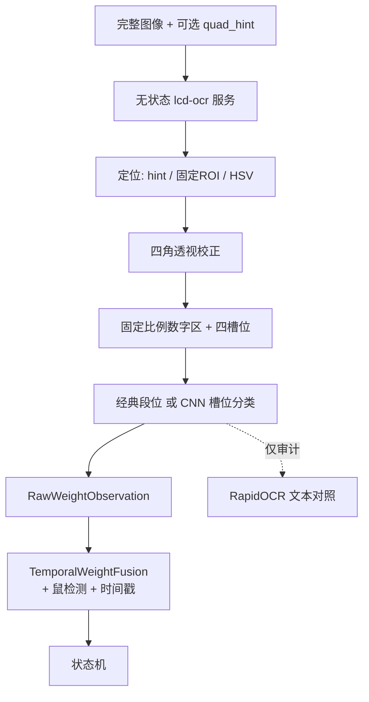

# LCD 七段码识别升级方案

## 1. 结论（已拍板）

最终共识：

1. **无状态单帧 OCR 服务**：只做 LCD 定位、规范化数字条和单帧读数；
2. **mousevision 侧时序融合**：`TemporalWeightFusion` 结合鼠检测与时间戳裁决稳定体重；
3. **阶段 B 强制无 CNN 验证**：先吸附 + 固定槽位 + `decode_seven_seg`，只有 0001 第 1、7、9 次仍失败才训模型；
4. **规则判断状态**：MVP 不做 `frame_state` 多头；`empty/stable/transition/occluded/needs_review` 全部在 mousevision；
5. **当前单秤型先落地**：代码保留 `scale_profile`，不一开始做多秤型。

主链路目标不是继续调通用 OCR 文本规则，而是保证识别器始终看到方向一致、尺度一致、边界完整的数字条。最终体重只能来自七段码读数 + 时序裁决；RapidOCR 仅作审计对照或实验性定位回退。

> **实现状态（阶段 B）**：
> - 本地关键帧：`accept_0001.py` **GATE PASS（7/7）**，含 `21.60` 回归样本。
> - 远程：`classic-sevenseg-v1` OCR + edge（fusion / cooldown）已部署。
> - 端到端 `source.mp4`：**9 session，needs_review=0**；
>   第 1/2/6/7/9 ≈ `22.75 / 21.60 / 24.18 / 22.71 / 22.80`。
> - `empty_arm` + `reenter_cooldown` **仅 http_ocr**；TemplateReader RefVideo 保持 8 session。
> - CNN（阶段 C）仍暂不优先。

## 2. 当前基线与问题

### 2.1 0001 回放基线

源视频约 74.7 秒，实际包含 **9 次称重**。当前 RapidOCR-only 版本能够检出 9 个 session，但仍有以下代表性错误：

| 次序 | 视频屏幕约值 | 当前保存值 | 错误类型 |
|---:|---:|---:|---|
| 1 | 22.75g | 22.15g | 七段码 `7 → 1` |
| 7 | 22.76g | 22.16g | 七段码 `7 → 1` |
| 9 | 22.80g | 8.22g | 数字顺序/文本方向错误，`2280 → 0822` |

其他平台段已能接近屏幕读数，但这三类错误说明通用 OCR 的高置信度不能直接作为体重真值。

### 2.2 性能基线

当前服务对每帧生成 4 个预处理变体，并为每个变体执行完整的检测、方向分类和文字识别：

- 单帧约 0.8–2.0 秒；
- 74.7 秒视频整段回放约 15 分钟；
- `mousevision-lcd-ocr` 常驻内存约 1.4GB，峰值约 1.6GB；
- `/health` 中的 `latency_ms: 0.0` 当前是静态值，不能作为真实性能指标。

因此当前实现只能作为可行性验证，不能作为正式主路径。

## 3. 设计原则

### 3.1 最终值归属

- RapidOCR 返回的文字不得直接写入称重曲线；
- RapidOCR 可以提供审计文本，不决定最终体重；
- 最终四位数字必须由七段码路径（经典段位或后续 CNN）从规范化数字条中读取；
- 最终体重必须经过 `TemporalWeightFusion` 裁决后才能进入状态机。

### 3.2 不允许自动倒转

当前视频采集方向是已知的，不应让通用文字方向分类器随意执行 180° 翻转。方向应由几何规则固定：

1. LCD 四角按 `左上 → 右上 → 右下 → 左下` 排序；
2. 透视校正输出始终为横向标准屏幕；
3. 数字槽位始终从左向右编号；
4. 可用秤屏的左侧符号区、右侧 `g` 区或固定相对布局作为方向校验；
5. 无法确认方向时返回 `bad_roi` / `unreadable`，禁止猜测和倒读。

### 3.3 无状态服务 + 调用方持有跟踪

- OCR 服务不保存跨请求状态，也不需要 `session_id`；
- 每个 `SessionDriver` 自己持有融合状态与上一帧 `screen_quad`；
- 正常帧只运行一次定位/微调和一次七段码推理；
- 不对每帧生成 4 个变体并完整执行 4 次 OCR。

## 4. 目标架构



职责切分：

| 组件 | 职责 |
|---|---|
| `services/lcd_ocr` | 定位、warp、单帧 digits / quality / raw status |
| `HttpOcrReader` | HTTP 客户端，返回 `RawWeightObservation`；保存并回传 `quad_hint` |
| `TemporalWeightFusion` | 跨帧共识、冲突检测、`needs_review` |
| `WeighingStateMachine` | 只消费稳定体重观察 |

## 5. LCD 与数字区吸附

### 5.1 定位职责

- **唯一实现**放在 OCR 服务：HSV quad、校验、微调、warp、固定 digit ROI；
- `HttpOcrReader` **不再**本地执行 `find_lcd_box`；
- 调用方保存上一帧 `screen_quad`，下一次作为可选 `quad_hint` 传给无状态 API；
- 服务优先验证/微调 hint，失效时重新定位。

正式回退顺序：

```text
上一帧 quad_hint
→ 当前秤型固定 ROI 外扩
→ 全图 HSV quad
→ 可选轻量定位模型
→ RapidOCR Det（实验选项，非必须依赖）
```

RapidOCR Det 不纳入正式硬依赖，也不计入硬性回退率目标。

### 5.2 定位输出

```python
@dataclass
class LocateResult:
    screen_quad: list[tuple[float, float]]
    confidence: float
    method: str              # quad_hint | fixed_roi | hsv_quad | light_det | rapid_det
    orientation: str         # upright | invalid
```

### 5.3 透视校正与固定数字区

将 `screen_quad` 透视校正为标准画布，例如 `480 × 128`。数字区使用 `scale_profile` 配置的相对坐标：

```yaml
scale_profile: current_scale_v1
lcd_normalization:
  width: 480
  height: 128
  digit_roi: [0.18, 0.10, 0.72, 0.82]  # x, y, w, h；以标注数据校准
  digit_slots: 4                         # 固定四格，跳过投影切分
  min_locator_confidence: 0.80
```

不要直接沿用现有自动蓝框的每帧高度作为数字裁切基准。先标准化整块 LCD，再裁固定数字区，避免蓝屏轮廓高度从约 100px 到 160px 变化时数字被截断。

### 5.4 调用方侧的框平滑

由于服务无状态，跨帧平滑由调用方完成：

- 首帧或失锁时不传 `quad_hint`，触发完整定位；
- 正常帧把上一帧 `screen_quad` 作为 hint；
- 服务返回的新 quad 由调用方做 EMA / 限幅后再用于下一帧；
- 连续若干帧 `bad_roi` 才判定 `lcd_not_found`；
- 同一视频中禁止四角顺序突然反转（由服务方向校验 + 调用方拒绝反转 hint）。

## 6. 单帧识别（OCR 服务）

### 6.1 单帧状态（仅此四种）

OCR 服务**不**输出 `stable/transition` 等时序结论。单帧 `status` 只保留：

| status | 含义 |
|---|---|
| `readable` | 四槽位可读，已解析出体重候选 |
| `zero_display` | 屏幕显示为空秤读数（如 `0.00` / 全 blank） |
| `unreadable` | 槽位无效、质量过低或笔画不可信 |
| `bad_roi` | 定位/方向/数字区失败 |

### 6.2 阶段 B：无 CNN 主路径

阶段 B 依次比较：

1. 原始 `TemplateReader`；
2. 透视校正 + 固定数字 ROI + 现有投影切分；
3. **透视校正 + 四个固定槽位 + `decode_seven_seg`**（优先验证）；
4. RapidOCR 仅作审计对照。

第 3 种最值得试：规范化后直接固定切四格，跳过当前不稳定的 `_projection_slots`。若完整保留 `7` 的顶部横段，经典段位解码可能直接解决 `7→1`。

**只有 0001 的第 1、7、9 次仍失败，才进入 CNN 阶段。**

### 6.3 CNN MVP（条件触发）

若阶段 B 不足，再训练“整条数字区输入 + 四槽位分类”：

```text
digit_0..3: blank / 0..9 / invalid
digit_confidences: 4 × float
quality: 0..1
```

不做 `frame_state` 多头。小数点位置由 `scale_profile` 配置；当前秤将四位解析成 `XX.XX`，前导 blank 时解析成 `X.XX`。

模型可选小型 CNN 或缩减版 MobileNetV3-Small；导出 ONNX + OpenVINO FP16。目标模型文件数 MB 到十几 MB。

### 6.4 为什么能解决现有错误

- `7 → 1`：固定槽位保留完整笔画；阶段 B 可对 `7` 顶部横段做几何校验；CNN 阶段同理；
- `2280 → 0822`：槽位顺序由标准画布固定，禁止方向分类器倒转；
- 空秤与过渡：由 mousevision 规则 + 时序判断；
- 反光/遮挡：单帧返回 `unreadable`/`bad_roi`，不强行拼数字。

## 7. mousevision 时序融合

### 7.1 结构化观察

`HttpOcrReader` 不再只返回 `(weight, confidence)`：

```python
@dataclass
class RawWeightObservation:
    weight: float | None
    digits: list[str]
    digit_confidences: list[float]
    quality: float
    status: str                 # readable | zero_display | unreadable | bad_roi
    screen_quad: list | None
    locator_confidence: float
    locator: str | None = None
    model_version: str | None = None
```

融合输出：

```python
@dataclass
class StableWeightObservation:
    weight: float
    confidence: float
    digits: list[str]
    reason: str                 # consensus | ...
    needs_review: bool = False
```

数据流：

```text
HttpOcrReader
    ↓ RawWeightObservation
鼠检测结果 + 时间戳
    ↓
TemporalWeightFusion
    ↓ StableWeightObservation / None / needs_review
    ↓
状态机
```

### 7.2 相关错误防线

3/5 投票只能作为“可以开始形成平台”的门槛，**不能直接决定最终值**。

针对连续相关错误（如多帧同错 `7→1`）：

1. `1/7` 槽位使用更高置信度门槛；
2. 对 `7` 的顶部横段增加独立几何校验（阶段 B 即可落地）；
3. 按整个平台形成候选簇，而不是只看连续相同值；
4. 若同时存在 `22.16` 与 `22.76` 两个持续簇，标记冲突 → `needs_review`；
5. RapidOCR 与七段码冲突时只触发 `needs_review`，不自动覆盖；
6. 原始观察值全部保留；跳变过滤不修改原始曲线，只能作为后期辅助权重。

### 7.3 其他规则

1. 仅 `readable` 且槽位置信度达标的观察进入候选；
2. `zero_display` / `unreadable` / `bad_roi` 不进入有效体重曲线；
3. 鼠检测为真但显示 `zero_display` 时，判为过渡/无效，不触发离秤；
4. 无共识或簇冲突时保存 `needs_review`，不静默生成错误体重。

## 8. 训练数据（仅 CNN 阶段需要）

### 8.1 范围

第一版只覆盖当前这一台秤；代码层保留 `scale_profile`。

建议量级：

| 用途 | 量级 |
|---|---|
| 定位标注 | 每视频约每 30–60 帧标一次四角，其余跟踪插值并人工抽查 |
| 经典段位阶段 | 不需要训练数据 |
| CNN 预训练 | 合成七段码 |
| CNN 微调 | 约 500–1500 张真实数字条 |
| 困难样本 | 300–500 张空秤、过渡、反光、遮挡 |
| 视频多样性 | 至少 5–10 段独立录像，按视频切分 |
| 0001 | **端到端门禁，不作为主要训练集** |

### 8.2 标注内容

```json
{
  "video_id": "...",
  "frame_index": 904,
  "screen_quad": [[x1,y1],[x2,y2],[x3,y3],[x4,y4]],
  "digits": ["2", "2", "8", "0"],
  "weight": 22.80,
  "display_kind": "nonzero"
}
```

`display_kind` 可用 `nonzero / zero / occluded / glare` 等，供采样与评估；**不**训练成 frame_state 多头。

### 8.3 伪标签约束

RapidOCR 可预生成候选框/文本并帮助筛帧，但结果不能未经人工或多帧确认就作为训练真值，否则会把 `0822`、`22.15` 等错误写入数据集。

训练/验证/测试必须按视频或录制批次切分，不能随机按相邻帧切分。

## 9. API

保留现有端点：

- `GET /health`
- `POST /v1/lcd/read`
- `POST /v1/lcd/read-batch`

请求可增加可选 `quad_hint`（上一帧四角）。响应示例：

```json
{
  "weight": 22.80,
  "digits": ["2", "2", "8", "0"],
  "digit_confidences": [0.99, 0.98, 0.95, 0.97],
  "quality": 0.96,
  "status": "readable",
  "locator": "quad_hint",
  "locator_confidence": 0.94,
  "screen_quad": [[...], [...], [...], [...]],
  "model_version": "classic-sevenseg-v1",
  "actual_device": "CPU",
  "latency_ms": {
    "locate": 2.1,
    "warp": 0.8,
    "infer": 3.4,
    "total": 6.5
  }
}
```

`HttpOcrReader` 返回完整 `RawWeightObservation`；是否进入曲线由 `TemporalWeightFusion` 决定，而不是在 reader 内把非 stable 直接压成 `None` 后丢原因。

`/health` 必须跑真实 warmup/probe，分别报告：

- 模型纯推理延迟；
- `locate + warp + infer` 服务端延迟；
- （调用方侧另计）含 HTTP 的端到端延迟。

## 10. 代码布局

```text
services/lcd_ocr/
  app.py
  locator.py              # hint 校验、固定 ROI、HSV quad；实验性 Det
  normalize.py            # 透视校正、固定 digit ROI / 四槽位
  sevenseg_classic.py     # 固定槽位 + decode_seven_seg
  sevenseg_cnn.py         # 条件启用的 OpenVINO CNN
  rapid_audit.py          # 懒加载审计 OCR（不决定最终体重）
  schemas.py
  models/                 # 仅 CNN 阶段需要
  training/               # 仅 CNN 阶段需要

mousevision/
  reader/http_ocr.py      # RawWeightObservation + quad_hint 回传
  reader/observations.py  # Raw / Stable dataclass
  fusion/temporal.py      # TemporalWeightFusion
  detector/__init__.py    # 只吃 StableWeightObservation
  analyzer/__init__.py    # 按平台候选簇选值；跳变过滤不改原始曲线
```

配置：

- `configs/scale_refvideo.yaml`：增加 `scale_profile`、locator、sevenseg、temporal；
- 删除/停用客户端本地 `find_lcd_box` 作为主定位路径。

## 11. 分阶段实施

### 阶段 A：评估工具与门禁骨架

- 固化 0001 的 9 个称重时间段和目视真值；
- 导出 LCD 四角、标准化屏幕、数字条调试图；
- 建立关键帧门禁 + 端到端 replay 报告骨架；
- 性能口径拆成：纯推理 / 服务端 total / HTTP e2e / `frame_stride=2` 回放。

### 阶段 B：定位吸附 + 无 CNN 验证（强制）

依次对比并报告：

1. 原始 TemplateReader；
2. warp + 固定 ROI + 投影切分；
3. warp + 固定四槽位 + `decode_seven_seg`；
4. RapidOCR 审计对照。

通过标准：0001 第 1、7、9 次恢复正确，且端到端 9 session。若通过，**可跳过或推迟阶段 C**。

### 阶段 C：七段码 CNN（条件触发）

仅当阶段 B 在第 1、7、9 次仍失败时：

- 合成预训练 + 500–1500 真实数字条微调；
- 导出 ONNX/OpenVINO；
- CPU 与 Iris Xe 分别 benchmark，以真实 p95 选默认设备。

### 阶段 D：RapidOCR 降级

- 默认不加载完整 recognizer；
- 审计识别与最终体重字段分离；
- 删除正常帧 4 变体全量 OCR 路径；
- Det 仅作实验回退，不进硬性 KPI。

### 阶段 E：TemporalWeightFusion + 状态机

- 接入 `RawWeightObservation`；
- 平台候选簇 + `1/7` 专项门槛 + 冲突 `needs_review`；
- 鼠在秤上拒绝 `zero_display` 离秤；
- 原始曲线完整保留。

### 阶段 F：灰度部署

- shadow 模式同时记录旧/新结果；
- 通过两套门禁后切换主 reader；
- 保留配置开关以便回滚。

## 12. 验收标准

### 12.1 两套门禁

| 门禁 | 作用 |
|---|---|
| `accept_0001.py` | 关键帧、定位、单帧数字识别 |
| 端到端 replay | 必须输出 9 个 session；第 1、7、9 次正确 |

两者都保留；**不通过则不要切主路径 `weight_reader`。**

### 12.2 定位

- 可见清晰 LCD 帧的定位成功率 ≥ 99.5%（困难帧单独统计）；
- 标准化后数字条不得截断顶部/底部笔画；
- 同一视频中左右方向反转次数为 0；
- 稳定镜头下标准画布角点抖动 ≤ 3px（p95）。

### 12.3 识别

- 稳定平台帧四位数字完全正确率 ≥ 99%；
- session 最终体重（平台共识值）误差 ≤ 0.05g；
- `7 → 1` 与 `2280 → 0822` 专项全部通过；
- 空秤、过渡、遮挡不生成有效体重。

### 12.4 0001 端到端

- 必须检出 9 次称重，不多、不少；
- 第 1、7 次应恢复为约 22.7g；
- 第 9 次应恢复为约 22.8g；
- 代表照片、平台时间和最终体重一致；
- 无 `8.22g`、`0g` 等错误记录。

### 12.5 性能与资源（分口径）

| 口径 | 目标 |
|---|---|
| 模型纯推理 p95 | ≤ 10ms（CNN）/ 经典段位应更低 |
| 服务端 `locate+warp+infer` p95 | ≤ 20ms |
| 含 HTTP 调用延迟 | 单独计量，不与服务端混报 |
| `frame_stride=2` 的 74.7s 回放 | ≤ 60s，后续目标快于实时 |
| 主路径常驻内存 | ≤ 400MB |
| RapidOCR | 懒加载或独立审计进程；不进主路径常驻 |

## 13. 风险与应对

| 风险 | 应对 |
|---|---|
| 单一秤型过拟合 | 第一版只覆盖当前秤；配置与模型记录 `scale_profile` |
| 阶段 B 已够用仍盲目训 CNN | 强制无 CNN 门禁；第 1/7/9 通过则推迟 CNN |
| 连续相关错误击败 3/5 投票 | 平台候选簇 + `1/7` 高门槛 + 顶部横段校验 + 冲突 review |
| 服务/客户端双份定位 | 定位实现只在 OCR 服务；调用方只传 `quad_hint` |
| RapidOCR Det 对七段码不稳定 | Det 仅实验；正式回退为 hint → 固定 ROI → HSV |
| 伪标签污染 | 伪标签仅候选；0001 不作主训练集 |
| 跳变过滤误删正确点 | 不修改原始曲线；仅作后期辅助权重 |
| GPU 对极小模型更慢 | CPU/GPU 双测，以真实 p95 选设备 |

## 14. RapidOCR 官方能力参考

RapidOCR 官方文档确认 `Det`、`Cls`、`Rec` 可独立开关。本方案仅可能在实验路径使用 Det，正式主路径不依赖它决定体重：

- <https://rapidai.github.io/RapidOCRDocs/main/install_usage/rapidocr/usage/>
- <https://github.com/RapidAI/RapidOCR>
