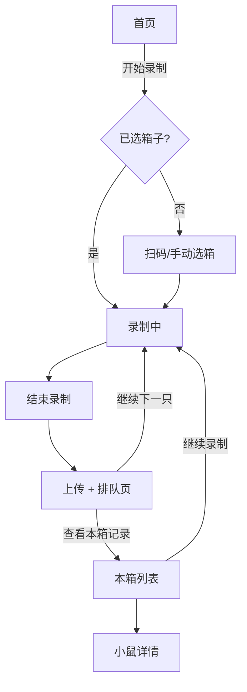
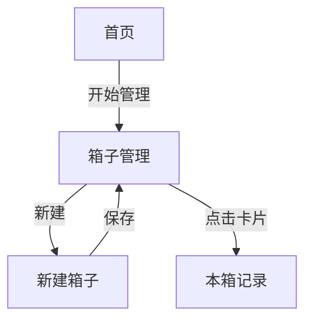
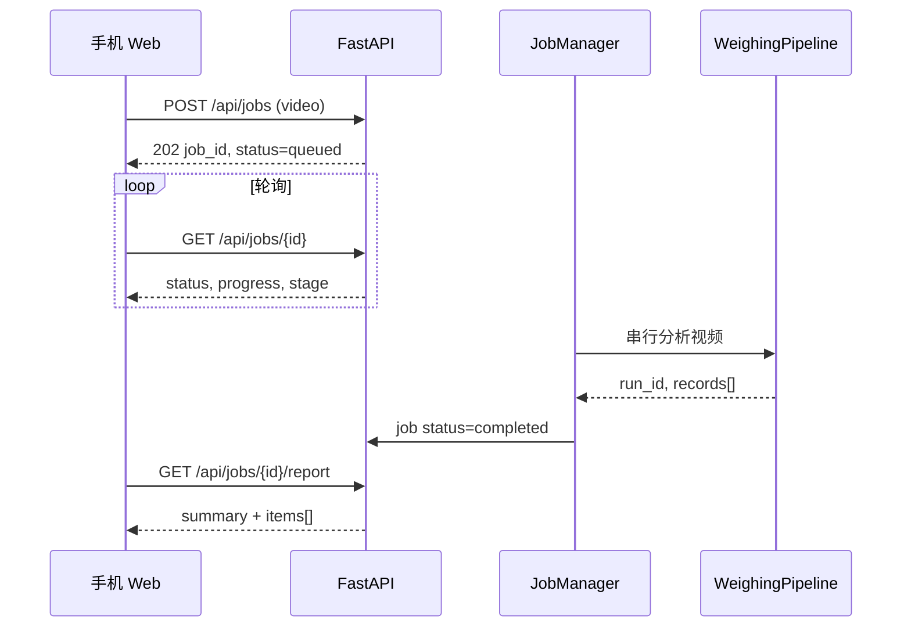

# 小鼠称重记录 — 手机 Web 应用设计文档

| 项目 | 内容 |
|------|------|
| 产品名称 | 小鼠称重记录（MouseVision Mobile） |
| 版本 | v1.0 设计稿 |
| 关联文档 | [WEB_APP_FRAMEWORK.md](./WEB_APP_FRAMEWORK.md)、[README.md](../README.md) |
| 入口路径 | `/mobile` |
| 目标用户 | 实验室操作人员（手持手机对单只小鼠称重录像） |

---

## 1. 文档目的

本文档在 UI 设计稿（8 个核心页面）与现有 **MouseVision Edge** 系统架构之间建立映射关系，明确：

- 页面结构、交互与视觉规范
- 与后端 `FastAPI`、分析任务队列、`run_id / cage_id / ordinal` 数据模型的对接方式
- 现有能力复用范围与待开发缺口
- 分阶段实施建议

当前仓库已实现基础手机 Web 框架（单页录像上传 + 任务轮询 + 批次报告），本设计将其演进为**面向高吞吐实验室场景的多页面工作流**。

---

## 2. 产品定位

### 2.1 核心价值

手机只负责**扫码选箱 → 单只录像 → 上传**；OCR 读数、状态机分段、曲线回溯、稳定体重计算均由边缘服务器完成。操作员无需连接数据线或手工抄录体重。

### 2.2 与桌面管理端的分工

| 端 | 路径 | 职责 |
|----|------|------|
| 手机 Web | `/mobile` | 现场称重录制、箱号选择、本箱记录查看 |
| 桌面管理 | `/` | 历史复核、视频回放、重新分析、上传队列、系统设置 |

手机端强调**线性、单手、快速连续操作**；管理端强调**审计、批量查看、算法调试**。

### 2.3 录制粒度

UI 设计采用 **「一箱上下文 + 逐只录像」** 模式：

- 一次录像对应**一只小鼠**的完整放鼠—称重—取走过程（约 30–60 秒）
- 箱号（`cage_id`）在扫码后锁定，鼠只编号（`ordinal`）在箱内自动递增
- 后端仍使用现有 `WeighingPipeline` 分析单段视频；若视频中检出多只，按现有逻辑分段输出多条 `record.json`（兼容模式）

---

## 3. 现有系统架构对接

### 3.1 技术栈（已实现）

```text
┌─────────────────────────────────────────────────────────────┐
│  手机浏览器 (HTTPS)                                          │
│  mobile.html / mobile.js — getUserMedia + MediaRecorder      │
└──────────────────────────┬──────────────────────────────────┘
                           │ REST (JSON / multipart)
┌──────────────────────────▼──────────────────────────────────┐
│  FastAPI (ui/app.py) — 端口 8766                               │
│  ├── AnalysisJobManager — 单 worker 串行分析队列               │
│  ├── JobStore (SQLite: output/jobs.db)                        │
│  ├── MouseRegistry (output/mice_registry.json + run_*/)       │
│  └── WeighingPipeline — 状态机 + TemplateReader + 曲线回溯    │
└──────────────────────────┬──────────────────────────────────┘
                           │
┌──────────────────────────▼──────────────────────────────────┐
│  持久化 (output/)                                              │
│  jobs.db · job_uploads/<job_id>/ · run_<ts>_<id>/mouse_NNN/  │
└───────────────────────────────────────────────────────────────┘
```

### 3.2 核心数据模型（沿用）

| 概念 | 字段 | 说明 |
|------|------|------|
| 项目 | `project_id` | **任务标签**，默认 `default`。是否升级为数据隔离见 §3.5 |
| 箱子 / 箱号 | `cage_id` | UI「箱号」，如 `Box-20250708-001` 或 `C57-023` |
| 品系 | `strain` | 由箱子元数据维护；可规则推断（`C57*` → C57BL/6） |
| 批次 | `run_id` | 一次分析任务产出的目录边界（当前每个 job 一个 run） |
| 鼠只序号 | `ordinal` | 箱内累计第 N 只，**由服务器在箱子维度原子分配**，见 §3.5 |
| 单条记录 | `record_id` | UUID，对应 `mouse_NNN/record.json`，跨 run 全局唯一 |
| 分析任务 | `job_id` | 手机上传视频后的异步任务 |

> **重要（Phase 1 前置定稿项）**：`ordinal / project_id` 的语义在当前实现下与本文档早期草稿不一致，必须先按 §3.5 定稿身份与关联模型，否则连续录制会产生多条「第 1 只」，且跨 run 聚合、详情、删除接口都需返工。

单条记录 JSON 结构（现有）：

```json
{
  "cage_id": "C57-023",
  "ordinal": 3,
  "weight": 22.43,
  "confidence": 0.97,
  "timestamp": "2026-07-10T10:30:21",
  "photo": "photo.jpg",
  "record_id": "…",
  "run_id": "…"
}
```

### 3.3 任务状态机（已实现）

```text
uploading → queued → processing → completed
                                 ↘ failed
```

手机端需将 `queued / processing` 细化为 UI 标签：**等待分析**、**分析中**、**已分析**。

### 3.5 身份与关联模型（Phase 1 开发前必须定稿）

> 本节修正早期草稿中 `ordinal / project_id / job_id / record_id` 的不一致定义。以下为**开发约束**，不是可选建议。

#### 3.5.1 现状约束（代码事实）

- 每个上传任务 `_run_pipeline` 均以 `create_run=True` 新建 `run_id`（`mousevision/jobs.py`）。
- `SessionDriver.session_index` 每个 run 从 0 开始，`ordinal = session_index`（`mousevision/driver.py`）。
- **结论**：单鼠视频逐段上传时，每段都会保存为 `ordinal=1`，无法表达「箱内第 4 只」。
- `project_id` 仅存在于 `jobs` 表，`create_run_dir` / record / pipeline 均未接收该字段（`mousevision/run.py`）。
- **结论**：按 `cage_id` 跨 run 聚合时，不同项目的同名箱子会混在一起。

#### 3.5.2 `ordinal` 定稿规则

`ordinal` 是**箱子（+项目）维度的累计序号**，必须由服务器分配，不能只靠前端递增：

1. **服务器原子分配**：在箱子 registry 维护 `next_ordinal`，创建 job 时原子 `reserve` 并返回 `requested_ordinal`；多手机并发操作同一箱子时用行锁 / 事务保证不重号。
2. **pipeline 接受入参**：`run_video(...)` / `SessionDriver` 增加 `start_ordinal`（或 `requested_ordinal`），`ordinal = start_ordinal + session_index`，替代当前恒为 1 的行为。
3. **单只结果**（`expected_single=true`，UI 默认）：唯一记录直接使用 `requested_ordinal`。
4. **多只结果**（同一 job 检出 >1 只）：`requested_ordinal` 用于第一只，其余顺延占用后续预留号段；job 标记 `warning: multi_detected`，UI 展开为多条列表项（见 §8.1）。
5. **零结果**（检出 0 只）：不生成 record，`requested_ordinal` 尝试释放回收（仅当它仍是当前尾号时成功）；job 标记 `warning: no_detection`。
6. **失败任务**：尝试释放 `requested_ordinal`（同样仅尾号回收）；UI 用 `requested_ordinal` 占位展示（见 §8.1）。

> **空号策略（Phase 1 定稿）**：释放回收是 **tail-only best-effort**——只有当被释放的号仍是箱子当前 `next_ordinal - 1`（即尾号）时才回收。连续上传场景下（job A 预留 1、job B 预留 2、A 零检出），编号 1 无法回收，会形成**永久空号**。这是**有意的设计选择**，换取实现简单与永不重号的核心保证：空号在审计中可见（`requested_ordinal` 仍记录在 job），不会导致数据错乱。若未来要求零空号，需引入 reservation/free-list 表支持任意号段回收。多检出重编号失败时，额外预留的号段同样尝试 tail-only 释放，可能留下空段。

#### 3.5.3 `project_id` 定稿：选定「任务标签」

本文档采用 **B 方案：`project_id` 是任务标签，不提供数据隔离**（改动最小，满足 Phase 1）：

- `project_id` 随 job 保存，写入 run manifest 与 record 便于审计与显示；
- **聚合键是 `cage_id`**，不做项目级隔离；因此要求 `cage_id` 在部署内全局唯一（由箱号命名规范保证，如 `Box-20250708-001`）。

> 若未来确需多项目数据隔离（A 方案），需：`project_id` 写入 run manifest + record + boxes 主键，所有聚合 / 列表 API 强制 `?project_id=` 过滤，箱子唯一键改为 `(project_id, cage_id)`。此为 Phase 3 可选项，非 Phase 1 范围。

#### 3.5.4 QR payload 结构

二维码不使用裸箱号，改用带版本与项目的 JSON（或紧凑分隔串），便于演进与校验：

```json
{ "v": 1, "project_id": "default", "cage_id": "Box-20250708-001" }
```

- 前端解码后校验 `v` 与 `cage_id` 合法性（`^[A-Za-z0-9._-]{1,64}$`）；
- 兼容旧标签：解析失败时回退为「整串即 `cage_id`」。

#### 3.5.5 关联关系总览

```text
project_id ──(标签)── job_id ──1:1── run_id ──1:N── record_id
                        │                            │
                   requested_ordinal          actual_ordinal (= start_ordinal + session_index)
                        └────── cage_id ───────┘  (聚合键)
```

| ID | 由谁生成 | 何时确定 | 用途 |
|----|----------|----------|------|
| `job_id` | 服务器（创建任务） | 上传时 | 任务轮询、列表占位 |
| `requested_ordinal` | 服务器（箱子分配） | 上传时 | 排队/进行中/失败时的占位编号 |
| `run_id` | 服务器（pipeline） | 分析开始 | 目录边界、审计 |
| `record_id` | 服务器（recorder） | 分析完成 | 记录唯一标识、详情/删除 |
| `actual_ordinal` | 服务器（pipeline） | 分析完成 | 最终「第 N 只」 |

### 3.6 已具备 API（可直接复用）

| 方法 | 路径 | 用途 |
|------|------|------|
| GET | `/api/health` | 服务与队列健康 |
| POST | `/api/jobs` | 上传视频并创建分析任务 |
| GET | `/api/jobs` | 最近任务列表 |
| GET | `/api/jobs/{job_id}` | 单任务状态轮询 |
| GET | `/api/jobs/{job_id}/report` | 任务完成后的体重报告 |
| GET | `/api/runs` | 批次列表 |
| GET | `/api/mice?run_id=` | 某批次下鼠只列表 |
| GET | `/api/mice/{ordinal}` | 单只详情 |
| GET | `/api/mice/{ordinal}/photo` | 稳定帧照片 |

写操作需请求头 `X-MouseVision-Token`（见 [WEB_APP_FRAMEWORK.md §8](./WEB_APP_FRAMEWORK.md)）。

---

## 4. 信息架构与路由

采用**轻量多页 SPA**（单 HTML 入口 + 前端路由），避免整页刷新，保留相机流状态。

| 路由 | 页面 | UI 设计对应 |
|------|------|-------------|
| `/mobile` | 首页 / 待机 | 屏 1 |
| `/mobile/scan` | 扫码选择箱子 | 屏 2 |
| `/mobile/record` | 录制中 | 屏 3 |
| `/mobile/done` | 录制完成 / 排队 | 屏 4 |
| `/mobile/box/:cageId` | 本箱记录列表 | 屏 5 |
| `/mobile/mouse/:recordId` | 小鼠详情 | 屏 6 |
| `/mobile/manage` | 箱子管理 | 屏 7 |
| `/mobile/manage/new` | 新建箱子 | 屏 8 |
| `/mobile/settings` | 设置（从首页齿轮进入） | 扩展 |

**导航原则**

- 顶部栏：标题 + 返回（子页）或设置（首页）
- 主操作固定在底部全宽按钮（拇指热区）
- 录制页隐藏底部 Tab，全屏取景

> **路由实现约束（Phase 1 必须处理）**：后端当前仅注册精确路径 `/mobile`（`ui/app.py`），直接打开或刷新 `/mobile/record` 会 404。二选一：
> - **A（推荐）** FastAPI 增加 fallback：`@app.get("/mobile/{path:path}")` 统一返回注入 token 后的 `mobile.html`，前端用 History API；注意该 fallback 不能吞掉 `/api/*` 与 `/static/*`（路由注册顺序 + 前缀判断）。
> - **B** 采用 hash 路由（`/mobile#/record`），无需后端改动，但 URL 不够干净、分享性差。
>
> 本文档后续路由表默认采用 A 方案的 path 形式；若选 B，将 `/mobile/scan` 读作 `/mobile#/scan`。

---

## 5. 视觉与交互规范

### 5.1 设计令牌

| 令牌 | 值 | 用途 |
|------|-----|------|
| 主色 | `#28a745` | 主按钮、成功态、已分析标签 |
| 警示红 | `#dc3545` | 结束录制、删除记录 |
| 等待灰 | `#6c757d` | 等待分析 |
| 进行中黄 | `#ffc107` | 分析中 |
| 背景 | `#ffffff` | 页面底色 |
| 正文 | `#212529` | 主文字 |
| 次要文字 | `#6c757d` | 时间、提示 |
| 圆角 | `12px` 卡片 / `8px` 输入框 | 统一圆角 |
| 触控最小高度 | `48px` | 按钮、列表行 |

### 5.2 组件库（建议）

- 无重型框架依赖，沿用 `mobile.css` 设计系统扩展
- 复用组件：`AppHeader`、`PrimaryButton`、`OutlineButton`、`StatusBadge`、`RecordListItem`、`BoxCard`、`FormField`、`ChipSelector`
- 图标：内联 SVG 或轻量 icon font（设置、返回、扫码框）

### 5.3 响应式

- 视口：`viewport-fit=cover`，适配刘海屏安全区
- 基准宽度：375px（iPhone SE ~ Pro Max）
- 横屏：录制页提示「请竖屏使用」

---

## 6. 页面设计详述

### 6.1 首页 / 待机（屏 1）

**目标**：进入主工作流或管理入口，展示最近活动。

**布局**

```
┌─────────────────────────────┐
│ 小鼠称重记录            ⚙   │
├─────────────────────────────┤
│                             │
│     [ 小鼠+电子秤示意图 ]      │
│                             │
│  ┌─────────────────────┐    │
│  │     开始录制         │    │  ← 主按钮（绿）
│  └─────────────────────┘    │
│  ┌─────────────────────┐    │
│  │     开始管理         │    │  ← 描边按钮
│  └─────────────────────┘    │
│                             │
│  最近记录            查看全部 │
│  ┌─────────────────────┐    │
│  │ Box-… C57BL/6  12只  │    │
│  │ 2025-07-08 14:30    │    │
│  └─────────────────────┘    │
│  …                          │
└─────────────────────────────┘
```

**交互**

| 元素 | 行为 |
|------|------|
| 开始录制 | 若内存中有「当前箱子」→ 直达 `/mobile/record`；否则 → `/mobile/scan` |
| 开始管理 | → `/mobile/manage` |
| 最近记录项 | → `/mobile/box/{cageId}` |
| 查看全部 | → `/mobile/manage` |
| ⚙ 设置 | → `/mobile/settings`（服务器地址、项目号、编号格式默认值） |

**数据**

- `GET /api/runs?limit=5` 或新增 `GET /api/boxes/recent`
- 列表项：`cage_id`、`strain`、`record_count`、`started_at`

---

### 6.2 扫码选择箱子（屏 2）

**目标**：确定本次称重的箱子上下文。

**布局**

- 全屏相机预览
- 中央绿色扫码框（约 60% 屏宽）
- 底部：`相册选择` | `手动输入`
- 提示文案：「将二维码放入框内，即可自动识别」

**交互**

| 元素 | 行为 |
|------|------|
| 相机流 | `getUserMedia` 后置摄像头；客户端 QR 解码（见 §7.2） |
| 识别成功 | 震动反馈 → 写入 `sessionStorage.currentBox` → `/mobile/record` |
| 相册选择 | `<input type="file" accept="image/*">` → 解码静态图 |
| 手动输入 | 底部 Sheet：箱号文本框 + 确认 |
| 返回 | 首页 |

**校验**

- 箱号须匹配 `^[A-Za-z0-9._-]{1,64}$`（与后端 `_SAFE_ID` 一致）
- 若箱号不在 registry，提示「新建箱子？」→ 跳转新建页并预填

---

### 6.3 录制中（屏 3）

**目标**：拍摄单只小鼠称重过程，保证秤盘与 LCD 清晰可见。

**布局**

```
┌─────────────────────────────┐
│ ←  录制中           00:00:12 │
├─────────────────────────────┤
│                             │
│      [ 完整相机预览，不裁切 ]   │
│      绿色：小鼠称重区（秤盘）   │
│      黄色：体重读数区（LCD）    │
│                             │
│         ( ● )               │  ← 红色结束按钮
│       结束录制               │
│                             │
│ 请保持手机稳定，确保显示屏清晰 │
└─────────────────────────────┘
```

相机可能在竖屏页面中返回横向视频流。录制页使用 `object-fit: contain` 保留完整画面，
两块引导框根据视频流的实际宽高比定位到可见画面内，不能按包含黑边的页面容器定位。

**参数（与现网一致）**

| 参数 | 值 |
|------|-----|
| 分辨率 | 720×1280（ideal） |
| 帧率 | 15 fps |
| 码率 | 1.5 Mbps |
| 分片 | `MediaRecorder.start(2000)` |
| 格式 | MP4/H.264 优先，WebM 兜底 |
| 音频 | 关闭 |

**交互**

| 元素 | 行为 |
|------|------|
| 进入页面 | 自动开启相机（需 HTTPS） |
| 计时器 | 录制开始后每秒更新 |
| 结束录制 | 停止 `MediaRecorder` → 生成 Blob → `/mobile/done` 并自动上传 |
| 返回 | 二次确认「放弃本次录制？」 |

**顶栏信息**

- 可选显示当前箱号缩写：`C57-023 · 第 04 只`

---

### 6.4 录制完成 / 排队（屏 4）

**目标**：确认上传成功，展示队列位置，引导连续作业。

**状态 A — 上传中**

- 进度条 + 百分比
- 文案：「正在上传视频…」

**状态 B — 已入队**

```
        ✓
  录制完成，视频已上传
  正在排队等待分析…

  当前排队位置    预计等待
      第 2 位      00:01:30

  ┌─────────────────────┐
  │   查看本箱记录       │
  └─────────────────────┘
  ┌─────────────────────┐
  │   继续录制下一只      │  ← 主按钮
  └─────────────────────┘
```

**数据计算**

| 字段 | 来源 |
|------|------|
| 排队位置 | `GET /api/jobs/queue` 中本 `job_id` 在 `queued` 列表的序号（**待新增**） |
| 预计等待 | `queue_position × avg_job_duration`；初期可用固定估算（如 90s/只） |
| 分析完成 | 轮询 `GET /api/jobs/{job_id}`，`status === completed` 时可选 Toast |

**交互**

| 元素 | 行为 |
|------|------|
| 继续录制下一只 | 递增本地 `nextOrdinal` → `/mobile/record`（保留同一箱子） |
| 查看本箱记录 | → `/mobile/box/{cageId}` |

---

### 6.5 本箱记录列表（屏 5）

**目标**：查看当前箱子下所有小鼠称重记录及分析状态。

**顶栏**

- 标题：`{cage_id}` + 品系副标题
- 右侧：`共 {n} 只`

**列表项**

```
┌────┬──────────────────────────┐
│缩略│ 22.43 g          [已分析] │
│图  │ 2025-07-08 14:32:15      │
└────┴──────────────────────────┘
```

**状态标签映射**

列表需同时展示「已完成的记录」和「尚无 record 的任务（排队/进行中/失败）」，因此**不能只用 `/api/mice`**（它只含已生成 record）。统一列表项以 `item_id` 为准，来源可能是 job（未完成）或 record（已完成），见 §8.1 数据模型。

| 列表项 `status` | 标签 | 颜色 | 是否有 `record_id` |
|-----------------|------|------|-------------------|
| `completed` | 已分析 | 绿 | 有 |
| `processing` | 分析中 | 黄 | 无 |
| `queued` / `uploading` | 等待分析 | 灰 | 无 |
| `failed` | 分析失败 | 红 | 无 |

- 编号显示：`completed` 用 `actual_ordinal`；未完成用 `requested_ordinal`（灰色占位，如「第 04 只 · 等待分析」）。
- 一个 job 检出多只时展开为多条 `completed` 项；检出 0 只时展示一条 `warning: no_detection` 项（无 record，可重录）。

**底部固定**：`继续录制` → `/mobile/record`

**数据**

- 主接口：`GET /api/boxes/{cage_id}/records`（**待新增**），返回 §8.1 统一列表模型，合并 jobs（未完成）与 records（已完成）。
- interim（Phase 1 早期）：`GET /api/jobs?cage_id=` + 已完成 job 的 `GET /api/jobs/{id}/report` 合并；仅在 boxes registry 就绪前使用。

---

### 6.6 小鼠详情（屏 6）

**目标**：单只复核：照片、体重、时间、分析状态。

**数据读取**：统一按 `record_id`，避免 `/api/mice/{ordinal}` 在跨 run 场景下歧义。

- `GET /api/records/{record_id}`（**待新增**）
- `GET /api/records/{record_id}/photo`（**待新增**）

**内容区**

- 大图/短视频回放（优先 `photo.jpg`；后续可挂 `clip` 短视频）
- 字段表：

| 字段 | 键 |
|------|-----|
| 箱号 | `cage_id` |
| 小鼠编号 | `actual_ordinal`（格式受箱子 `mouse_no_pad` 影响） |
| 体重 | `weight` g |
| 称重时间 | `timestamp` |
| 分析状态 | `completed`（详情页仅对已完成 record 开放） |

**操作**

| 按钮 | 行为 | 阶段 |
|------|------|------|
| 查看分析结果 | 展开曲线摘要、`confidence`、状态转换时间线（`state_history`） | Phase 2 |
| 删除记录 | `DELETE /api/records/{record_id}`（**待新增**） | **见下方权限说明** |

> **删除按钮权限依赖**：删除属管理员操作，但当前共享 token 无法区分操作员与管理员（见 [WEB_APP_FRAMEWORK.md §8](./WEB_APP_FRAMEWORK.md)），角色权限被安排在 Phase 3。因此：
> - **Phase 2**：默认**隐藏删除按钮**（或仅在管理端 `/` 提供删除），手机端只读；
> - 若业务必须在手机端删除，则需把「操作员/管理员」两级角色鉴权从 Phase 3 提前到 Phase 2。

---

### 6.7 箱子管理（屏 7）

**目标**：按品系浏览、筛选、进入箱子详情。

**顶栏**：`+ 新建箱子`

**Tab 筛选**：`全部` | `C57BL/6` | `BALB/c` | `其他`

**卡片**

```
Box-20250708-001
C57BL/6 · 2025-07-08 · 共 12 只
```

**交互**：点击卡片 → `/mobile/box/{cageId}`

**数据**：`GET /api/boxes?strain=&limit=`（**待新增**）

---

### 6.8 新建箱子（屏 8）

**目标**：创建可复用的箱子元数据，并生成可打印二维码。

**表单字段**

| 字段 | 类型 | 必填 | 说明 |
|------|------|------|------|
| 箱号 | text | 是 | 唯一，即 `cage_id` |
| 品系 | select | 是 | 预设 + 自定义 |
| 备注 | textarea | 否 | 自由文本 |
| 默认小鼠编号起始值 | chips | 是 | `01` / `001` / 自定义数字 |

**顶栏**：`保存`

**保存逻辑**

1. `POST /api/boxes` 写入箱子 registry（**待新增**）
2. 返回 `{ cage_id, qr_payload, qr_image_url }`
3. 可选：展示二维码供打印贴箱

**编号格式**

| 选项 | 显示示例 |
|------|----------|
| `01` | 第 01 只 |
| `001` | 第 001 只 |
| 自定义 | 用户输入起始整数 |

---

## 7. 关键技术方案

### 7.1 相机与 HTTPS

与 [WEB_APP_FRAMEWORK.md §6](./WEB_APP_FRAMEWORK.md) 一致：

- **HTTPS + 有效证书**：`getUserMedia` 实时预览与录制
- **HTTP 内网**：降级为系统相机/相册 `<input capture="environment">`
- 部署拓扑：`手机 HTTPS → Caddy/Nginx → http://edge:8766`

### 7.2 二维码扫描

**推荐方案（阶段 1）**：纯前端

- 库：[jsQR](https://github.com/cozmo/jsQR) 或 `@zxing/browser`
- 从 `<video>` 每 200–300ms 抽帧 `canvas` 解码
- 解码成功即锁定箱号，停止扫描循环

**阶段 2（可选）**：上传关键帧至 `POST /api/scan` 使用服务端 `pyzbar`（与 `mousevision/barcode.py` 对齐）

### 7.3 上传与弱网

沿用现有 `POST /api/jobs`（multipart），并按 §3.5 补充字段：

```http
POST /api/jobs
Content-Type: multipart/form-data

project_id=default        # 任务标签
cage_id=C57-023
requested_ordinal=4       # 服务器分配后回填；见下
expected_single=true      # 手机默认单只
video=<file>
```

> **`requested_ordinal` 分配时机**：不要让前端自己填数字。前端上传前先调 `POST /api/boxes/{cage_id}/reserve-ordinal`（或在 `POST /api/jobs` 内部原子预留），由服务器返回本次号；`POST /api/jobs` 携带该号仅作回显与幂等校验。pipeline 侧以 `start_ordinal = requested_ordinal` 计算最终 `ordinal`。

**阶段 2 增强**：分片上传、断点续传、上传失败重试队列（`IndexedDB` 暂存 Blob）。

### 7.4 状态同步

| 场景 | 方案 |
|------|------|
| 单任务进度 | 轮询 `GET /api/jobs/{id}`，指数退避 1s → 30s（现有 `mobile.js`） |
| 队列位置 | 轮询 `GET /api/jobs/queue`（待新增） |
| 本箱列表 | 进入页面拉取 + 下拉刷新；可选 SSE `GET /api/events`（阶段 3） |

### 7.5 前端状态（会话级）

```javascript
// sessionStorage — 单次作业会话
{
  "projectId": "default",
  "currentBox": {
    "cageId": "C57-023",
    "strain": "C57BL/6",
    "mouseNoStart": 1,
    "mouseNoFormat": "02",  // pad width
    "nextOrdinal": 4
  },
  "activeJobId": "uuid-…"
}

// localStorage — 持久偏好
{
  "serverBase": "",
  "lastCageId": "C57-023"
}
```

---

## 8. 新增 API 设计（相对现状）

### 8.1 箱子 Registry

**存储建议**：SQLite 表 `boxes`（需事务保证 `next_ordinal` 原子分配，`boxes.json` 无法安全并发），与 `MouseRegistry` 并列。

```json
{
  "cage_id": "Box-20250708-001",
  "project_id": "default",
  "strain": "C57BL/6",
  "notes": "",
  "mouse_no_start": 1,
  "mouse_no_pad": 2,
  "next_ordinal": 5,
  "created_at": "2025-07-08T10:00:00",
  "qr_payload": "{\"v\":1,\"project_id\":\"default\",\"cage_id\":\"Box-20250708-001\"}"
}
```

| 方法 | 路径 | 说明 |
|------|------|------|
| GET | `/api/boxes` | 列表，支持 `?strain=` `?limit=` |
| GET | `/api/boxes/{cage_id}` | 单箱元数据 + 统计 |
| POST | `/api/boxes` | 新建（需 token） |
| PATCH | `/api/boxes/{cage_id}` | 更新备注等 |
| POST | `/api/boxes/{cage_id}/reserve-ordinal` | **原子预留下一序号**，返回 `requested_ordinal`（需 token） |
| GET | `/api/boxes/{cage_id}/records` | 箱内统一列表（jobs + records 合并，见 §8.1a） |
| GET | `/api/boxes/recent` | 首页最近活动 |

> `reserve-ordinal` 在事务内 `SELECT next_ordinal ... FOR UPDATE`（或 SQLite `BEGIN IMMEDIATE`）后 `+1` 写回，保证多手机并发不重号。零检出回收策略见 §3.5.2。

#### 8.1a 统一记录列表模型（`GET /api/boxes/{cage_id}/records`）

合并「未完成 job」与「已完成 record」，前端只消费一种结构：

```json
{
  "items": [
    {
      "item_id": "job-a1b2",
      "job_id": "a1b2...",
      "record_id": null,
      "requested_ordinal": 4,
      "actual_ordinal": null,
      "status": "queued",
      "run_id": null,
      "weight": null,
      "photo_url": null,
      "created_at": "2026-07-10T16:31:44"
    },
    {
      "item_id": "rec-8e42",
      "job_id": "ff5f...",
      "record_id": "8e42b3bb...",
      "requested_ordinal": 3,
      "actual_ordinal": 3,
      "status": "completed",
      "run_id": "b5d1c12c...",
      "weight": 22.43,
      "photo_url": "/api/records/8e42b3bb.../photo",
      "created_at": "2026-07-10T16:31:45"
    }
  ]
}
```

**展开规则**

| job 结果 | 列表项 |
|----------|--------|
| 未完成（uploading/queued/processing） | 1 条占位项，`record_id=null`，编号用 `requested_ordinal` |
| 完成检出 1 只 | 1 条 `completed`，`actual_ordinal = requested_ordinal` |
| 完成检出 N>1 只 | N 条 `completed`（`warning: multi_detected`），编号顺延 |
| 完成检出 0 只 | 1 条占位项 `status=completed` + `warning: no_detection`，`record_id=null`，可重录 |
| 失败 | 1 条 `failed`，编号用 `requested_ordinal` 占位 |

排序：按 `requested_ordinal` 升序（同号时完成项优先）。

### 8.2 队列可见性

```http
GET /api/jobs/queue
```

> **路由注册顺序**：`/api/jobs/queue` 必须注册在动态路由 `/api/jobs/{job_id}` **之前**，否则会被解析为 `job_id="queue"` 返回 404。

响应示例：

```json
{
  "processing": {
    "job_id": "…", "cage_id": "C57-023",
    "processing_started_at": "2026-07-10T16:31:44",
    "elapsed_sec": 40
  },
  "queued": [
    { "job_id": "a", "position": 1, "cage_id": "C57-023", "requested_ordinal": 5 },
    { "job_id": "b", "position": 2, "cage_id": "BALB-001", "requested_ordinal": 2 }
  ],
  "avg_duration_sec": 85
}
```

**必须补充的状态时间戳**：当前 `jobs` 表只有 `created_at / updated_at`，无法准确算耗时。需新增列：

| 字段 | 写入时机 |
|------|----------|
| `queued_at` | 入队时 |
| `processing_started_at` | worker 取出开始分析时 |
| `completed_at` | 完成 / 失败时 |

`avg_duration_sec` = 最近 N 个 completed 任务的 `completed_at - processing_started_at` 滑动平均。

**预计等待公式**（不是简单 `position × avg`）：

```text
等待秒数 = 当前 processing 任务剩余时间 + (position - 1) × avg_duration_sec
其中 当前剩余 ≈ max(0, avg_duration_sec - processing.elapsed_sec)
若无 processing 任务，则 当前剩余 = 0
```

### 8.3 记录读取与删除（统一 `record_id`）

```http
GET    /api/records/{record_id}          # 详情
GET    /api/records/{record_id}/photo    # 稳定帧照片
DELETE /api/records/{record_id}          # 删除（权限见 §6.6）
```

- 需要 `record_id → run_dir` 的索引（可扫描 run_*/mouse_*/record.json 建立，或在 registry 增加映射表）。
- 删除：移除 `mouse_NNN/` 目录、更新 manifest 的 `record_count`。
- 保留旧接口 `/api/mice/{ordinal}?run_id=` 供管理端复核；手机端一律用 `record_id`，避免跨 run 歧义。

### 8.4 扩展 Job 创建

`POST /api/jobs` 增加字段：

| 字段 | 说明 |
|------|------|
| `requested_ordinal` | 服务器预留的序号（见 §8.1 reserve-ordinal），写入 manifest 与 record |
| `expected_single` | `true`（默认）：期望单只；检出 0 或 >1 只时按 §8.1a 规则展开并标记 `warning` |

pipeline 侧改造要点（Phase 1）：

- `run_video(..., start_ordinal=requested_ordinal)`，`ordinal = start_ordinal + session_index`；
- `create_run_dir(..., project_id=..., requested_ordinal=...)` 写入 manifest；
- record.json 增加 `project_id`、`requested_ordinal`、`actual_ordinal` 字段。

---

## 9. 核心用户流程

### 9.1 主流程（快乐路径）



### 9.2 管理流程



### 9.3 与后端分析时序



---

## 10. 非功能需求

### 10.1 性能

| 指标 | 目标 |
|------|------|
| 首屏可交互 | < 2s（内网） |
| 上传 10MB 视频 | < 30s @ 5Mbps |
| 单任务分析 | < 2min（2C4G 边缘盒） |
| 列表滚动 | 60fps，缩略图懒加载 |

### 10.2 可靠性

- 上传中断：提示重试，保留 Blob 至用户离开页面前
- 服务重启：`queued` 任务自动恢复；`uploading/processing` 标记失败（已实现）
- 单进程约束：禁止 `uvicorn --workers > 1`（见框架文档）

### 10.3 安全

- 生产环境必须 HTTPS + 反向代理登录或 VPN
- 共享 token 仅适用于全员可信内网；外网须代理注入 token
- 写操作限流：每 IP 10 次/分钟上传（建议）

### 10.4 兼容性

| 平台 | 最低版本 |
|------|----------|
| iOS Safari | 15+ |
| Android Chrome | 90+ |
| 微信内置浏览器 | 支持相册上传；实时录制视 HTTPS 而定 |

---

## 11. 现状差距与迭代计划

### 11.1 差距对照

> **实现状态（v1.0 已交付 Phase 0 + Phase 1 + 部分 Phase 2）**：下表「状态」列标注 ✅ 已实现 / ◻ 未做。

| UI 能力 | 状态 | 实现位置 / 说明 |
|---------|------|-----------------|
| **`ordinal` 累计编号** | ✅ | `BoxRegistry.reserve_ordinal`（原子）+ pipeline `start_ordinal`；多检出用 `renumber_records` 重编号避免重叠 |
| **`project_id` 语义** | ✅ | 「任务标签」写入 run manifest / record.json（`run.py`、`recorder.py`） |
| **SPA 子路由** | ✅ | `GET /mobile/{path:path}` fallback（`ui/app.py`） |
| 多页面导航 | ✅ | `mobile.js` History-API 路由 + 视图注册 |
| 首页最近记录 | ✅ | `GET /api/boxes/recent` |
| 扫码选箱 | ✅ | `BarcodeDetector` + 相册/手动兜底；QR payload `{v,project_id,cage_id}` |
| 排队位置/预估 | ✅ | `GET /api/jobs/queue`、`/{id}/wait` + `queued_at/processing_started_at/completed_at` |
| 本箱记录列表 | ✅ | `GET /api/boxes/{cage}/records` 统一列表模型（§8.1a） |
| 小鼠详情页 | ✅ | `GET /api/records/{record_id}` + `/photo` |
| 箱子管理/新建 | ✅ | `boxes` CRUD + `reserve-ordinal` + `qr.svg`（segno） |
| 删除记录 | ✅（API） | `DELETE /api/records/{record_id}`；手机端按钮按 §6.6 隐藏，待角色权限 |
| 设置页 | ✅ | 项目号 / 管理端入口 |
| 分片续传 / SSE / 角色权限 | ◻ | Phase 3 |

### 11.2 推荐迭代顺序

**Phase 0 — 身份与关联模型定稿（Phase 1 前置，必须先做）**

1. 确认 `ordinal` 服务器分配方案：`boxes` 表 `next_ordinal` + `reserve-ordinal` + pipeline `start_ordinal`（§3.5.2）。
2. 确认 `project_id` 采用「任务标签」B 方案，并将其写入 run manifest + record（§3.5.3）。
3. 确认 SPA 路由方案（fallback 或 hash，§4）。
4. 确认 QR payload 结构 `{v, project_id, cage_id}`（§3.5.4）。
5. record.json 增加 `project_id / requested_ordinal / actual_ordinal`，建立 `record_id → run_dir` 索引。

> 未完成 Phase 0，Phase 1 的连续录制会产生多条「第 1 只」，聚合/详情/删除接口需返工。

**Phase 1 — 工作流 MVP（2–3 周）**

1. 多页面壳 + 首页 / 扫码 / 录制 / 完成页
2. 服务器分配 `requested_ordinal`（会话上下文仅缓存，不做最终编号来源）
3. 扩展 `/api/jobs`（`requested_ordinal / expected_single`）+ 轮询
4. 本箱列表：统一列表模型 §8.1a（interim 可先合并 `/api/jobs?cage_id=` + report）

**Phase 2 — 管理闭环（1–2 周）**

1. `boxes` registry + 新建箱子 + 二维码 + `reserve-ordinal`
2. `/api/jobs/queue`（含状态时间戳）+ 排队 UI 与等待公式（§8.2）
3. 小鼠详情 `GET /api/records/{record_id}` + 分析结果展开
4. **删除按钮策略决策**：默认隐藏手机端删除；若必须，则将操作员/管理员角色鉴权从 Phase 3 提前至此（§6.6）

**Phase 3 — 体验与生产加固**

1. HTTPS 部署脚本、断点续传
2. SSE 推送、离线队列
3. 角色权限、审计日志（若 Phase 2 未提前）
4. 可选：`project_id` 升级为数据隔离 A 方案（§3.5.3）
5. 目标机型 MediaRecorder 格式验收

---

## 12. 文件结构建议（前端）

```text
ui/static/
├── mobile.html              # SPA 入口
├── mobile.css               # 设计令牌 + 组件
├── mobile/
│   ├── app.js               # 路由、启动
│   ├── router.js
│   ├── state.js             # 会话状态
│   ├── api.js               # 封装 api-client
│   ├── camera.js            # 相机/录制
│   ├── scanner.js           # QR 解码
│   └── views/
│       ├── home.js
│       ├── scan.js
│       ├── record.js
│       ├── done.js
│       ├── box-records.js
│       ├── mouse-detail.js
│       ├── manage.js
│       └── box-new.js
├── api-client.js            # 已有
└── assets/
    └── hero-scale.svg       # 首页插图
```

---

## 13. 附录

### A. 环境变量（与现网一致）

| 变量 | 默认 | 说明 |
|------|------|------|
| `MOUSEVISION_OUTPUT_DIR` | `./output` | 数据根目录 |
| `MOUSEVISION_MAX_UPLOAD_MB` | `250` | 上传大小上限 |
| `MOUSEVISION_API_TOKEN` | 空 | 写操作 token |

### B. 部署访问

```text
手机端：  https://<domain>/mobile
管理端：  https://<domain>/
健康检查：https://<domain>/api/health
```

Podman 本地测试见 [WEB_APP_FRAMEWORK.md §5](./WEB_APP_FRAMEWORK.md)。

### C. 术语表

| 术语 | 英文 | 说明 |
|------|------|------|
| 箱号 | cage_id / box_id | 同一笼小鼠的标识，二维码内容 |
| 品系 | strain | 如 C57BL/6 |
| 批次 | run | 一次分析产出目录 `run_*`（当前每 job 一个） |
| 请求序号 | requested_ordinal | 上传时服务器为箱子原子预留的编号 |
| 实际序号 | actual_ordinal | 分析完成后的最终「第 N 只」 |
| 任务 | job | 手机上传后的异步分析单元 |
| 记录 | record_id | 分析完成的单只记录唯一 ID |

---

*文档维护：随 `ui/static/mobile.*` 与 `/api/*` 演进同步更新。*
